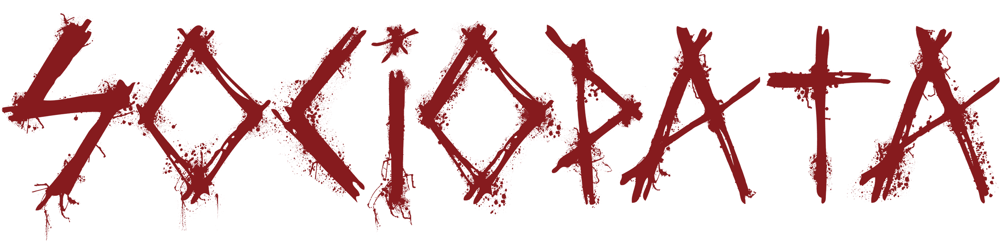

  

### Release

#### English

Sociopata started in 2008 in the cities of Bauru and Agudos, SP, Brazil, with the proposal to merge thrash metal with hardcore and progressive. The members are Kleber (vocals), Braga (guitar), Birão (bass), Léo (guitar) and Cowboy (drums). The band's releases are the demo Sociopata [2013] and the EP "Corrosão" [2016], in addition to performing several shows throughout the state of São Paulo.

The band's name is quite suggestive and open to interpretation, taking a psychological bias, as well as the lyrics, which lead listeners to self-analysis of their actions. Lyrics that address selfishness, greed, misinformation and social differences, among other topics that are almost always recent.

The band is focused on recording a new album in 2022.

#### Português

Sociopata surgiu em 2008 nas cidades de Bauru e Agudos, SP, com a proposta de fundir thrash metal com hardcore e progressivo. Os membros são Kleber (vocal), Braga (guitarra), Birão (baixo), Léo (guitarra) e Cowboy (bateria). Os lançamentos da banda são a demo Sociopata [2013] e o EP "Corrosão" [2016], além da realização de diversos shows pelo estado de São Paulo.

O nome da banda é bastante sugestivo e aberto à interpretação, partindo para um viés psicológico, bem como as letras, que levam os ouvintes à auto-análise de seus atos. Letras que abordam egoísmo, ganância, desinformação e diferenças sociais, entre outros tópicos quase sempre recentes.

A banda está concentrada na gravação de um novo álbum em 2022.

### Install (Docker)

Requirements:
- Docker Desktop

Run:
- `docker compose up --build -d`
- open http://localhost:3010

Stop:
- `docker compose down --timeout 0`

### Contatos

contato@sociopata.org  

### Localização

> Bauru, Agudos / SP / Brasil

### Vídeos

[youtu.be/Zne7DpwXZN4](https://youtu.be/Zne7DpwXZN4)  
[youtu.be/xUJfO0IFVkE](https://youtu.be/xUJfO0IFVkE)  
[youtu.br/YDMq7tUyDWQ](https://youtu.be/YDMq7tUyDWQ)  

### Músicas

[sociopata.bandcamp.com](https://sociopata.bandcamp.com)  
[soundcloud.com/sociopata](https://soundcloud.com/sociopata)  
[open.spotify.com/artist/4jThTw7lss5OnXBzwXYFSD](https://open.spotify.com/artist/4jThTw7lss5OnXBzwXYFSD)  

### Links

[fb.com/sociopatabr](https://fb.com/sociopatabr)  

### Resenhas

[whiplash.net/materias/news_819/195835-sociopata.html#.Uz4FQfnTGNd](https://whiplash.net/materias/news_819/195835-sociopata.html#.Uz4FQfnTGNd)  
[whiplash.net/materias/cds/197972-sociopata.html#.Uz4FQfnTGNd](https://whiplash.net/materias/cds/197972-sociopata.html#.Uz4FQfnTGNd)  
